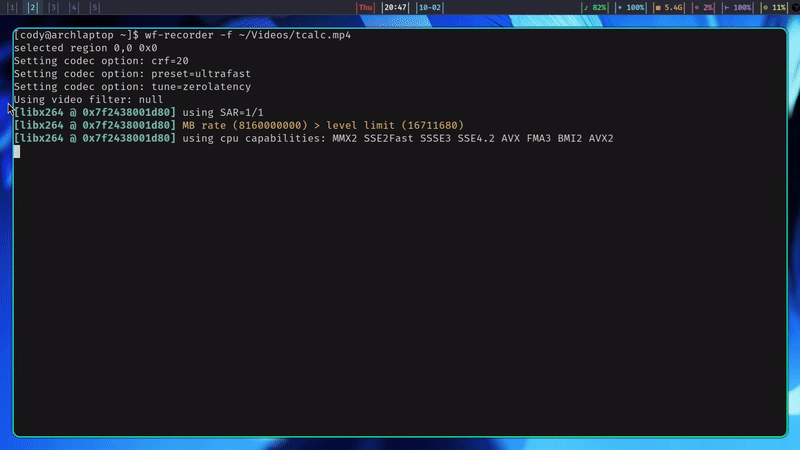

# tcalc

A terminal-based calculator with TUI interface built in Rust.



## Features

- **Dual Modes**: Basic and Scientific calculator modes
- **Interactive UI**: Button navigation with keyboard and mouse support
- **Typing Mode**: Direct expression input with live evaluation
- **Functions & Constants**: Type `sin`, `cos`, `tan`, `log`, `ln`, `sqrt`, `exp`, `abs`, and use `pi`/`π`, `e` in expressions
- **Calculation History**: View and recall previous calculations
- **Function Graphing**: Visualize mathematical expressions
- **Secondary Functions**: Access variables and constants via 2nd function key
- **Professional Interface**: Clean, color-coded button layout

## Controls

### Navigation
- `↑↓←→` - Navigate buttons
- `Enter`/`Space` - Press selected button
- Mouse click - Press button directly

### Modes
- `` ` `` - Toggle typing mode
- `m` - Switch between Basic/Scientific modes
- `h` - Toggle calculation history
- `2` - Toggle 2nd function mode from the keyboard
- `2nd` - Access secondary functions (variables, constants) via button

### Operations
- `c` - Clear current expression
- `C` - Clear all (expression and history)
- `⌫` - Backspace
- `r`/`Enter`/`Space` - Recall selected entry (when in history view; returns to calculator with expression)
- `Ctrl+g` - Graph current expression
- `?` - Show help modal
  
In Typing mode, you can enter scientific functions and constants directly, e.g. `sin(pi/2)`, `cos(0)`, `ln(e)`, `sqrt(2)`, `exp(1)`, `abs(-3.5)`. In button mode, starting with a leading minus is supported via the `−` button.

Note on Typing mode behavior:
- Letters and digits are treated as literal input (build identifiers like `sin`, variables like `x`).
- `2` does not toggle 2nd mode in Typing (use the `2nd` button or exit Typing).
- `c`/`C` do not clear in Typing; use the clear buttons or exit Typing to clear.
- `r` does not recall from history in Typing; it types the letter `r`.

Notes on History behavior:
- Newest entries appear at the top.
- Recalling an entry exits History and restores the original expression for editing.

### Graphing
- `↑↓←→` - Pan graph view
- `+/-` - Zoom in/out
- `r` - Reset view to default range
- `c` - Toggle coordinate display
- `Esc` - Exit graph mode

You can graph expressions that include variables and functions, e.g. `sin(x)`, `cos(x) + 0.5`, `ln(x)`, `sqrt(x^2 + 1)`. Mouse position updates the displayed coordinates within the drawn graph area.

### Exit
- `q` or `Esc` - Quit application

## Installation

```bash
git clone <repository-url>
cd tcalc
cargo build --release
./target/release/tcalc
```

## Dependencies

- `anyhow` - Error handling
- `chrono` - Timestamp formatting
- `crossterm` - Terminal control
- `ratatui` - TUI framework

## Usage

Run the application and use keyboard navigation or mouse clicks to interact with the calculator buttons. 

### Basic Operations
Switch to typing mode for direct expression input, or use button navigation for traditional calculator operation.

### Graphing Functions
1. Build an expression using variables (x, y, z, a, b, c) and constants (π, e)
2. Press `Ctrl+g` (always available) or use the Graph button in 2nd function mode
3. Use arrow keys to pan, +/- to zoom, and `r` to reset the view

### Variables and Constants
- **Variables**: x, y, z, a, b, c (available in 2nd function mode)
- **Constants**: `pi`/`π` (3.14159), `e` (2.71828)
- **Scientific functions**: `sin`, `cos`, `tan`, `log`, `ln`, `sqrt`, `exp`, `abs` (typeable in Typing mode; available as buttons in Scientific mode)

## License

This project is licensed under the [MIT License](LICENSE).
