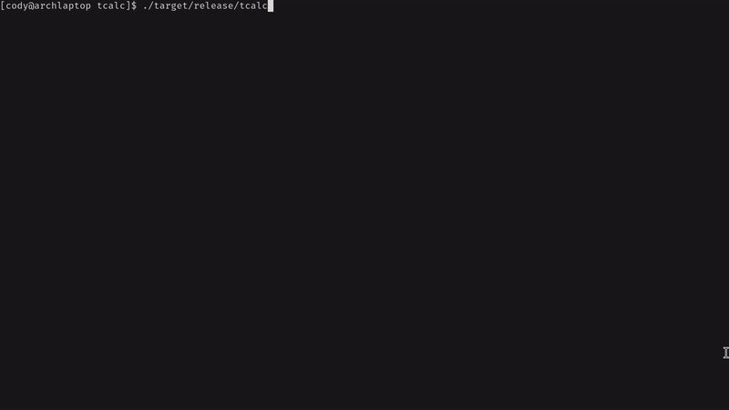

# tcalc

A terminal-based calculator with TUI interface built in Rust.



## Features

- **Dual Modes**: Basic and Scientific calculator modes
- **Interactive UI**: Button navigation with keyboard and mouse support
- **Typing Mode**: Direct expression input with live evaluation
- **Calculation History**: View and recall previous calculations
- **Professional Interface**: Clean, color-coded button layout

## Controls

### Navigation
- `↑↓←→` - Navigate buttons
- `Enter`/`Space` - Press selected button
- Mouse click - Press button directly

### Modes
- `` ` `` - Toggle typing mode
- `m` - Switch between Basic/Scientific modes
- `h` - Toggle calculation history

### Operations
- `c` - Clear current expression
- `C` - Clear all (expression and history)
- `⌫` - Backspace
- `r` - Recall from history (when in history view)

### Exit
- `q` or `Esc` - Quit application

## Installation

```bash
git clone <repository-url>
cd tcalc
cargo build --release
./target/release/tcalc
```

## Dependencies

- `anyhow` - Error handling
- `chrono` - Timestamp formatting
- `crossterm` - Terminal control
- `ratatui` - TUI framework

## Usage

Run the application and use keyboard navigation or mouse clicks to interact with the calculator buttons. Switch to typing mode for direct expression input.

## License

This project is licensed under the [MIT License](LICENSE).
